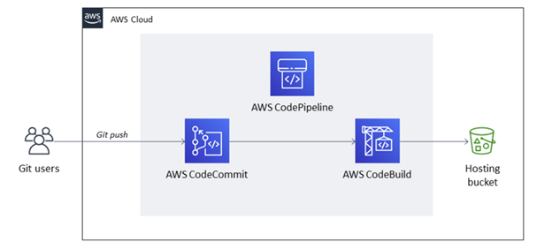

# terraform-to-build-hugoweb-with-aws-service

Code Terraform được chia làm 2 phần là xây dựng trang website tĩnh với AWS S3 và dựng pipeline dựa trên AWS CodePipeline để tự động build code Hugo, cập nhật nội dung của trang web mỗi khi có sự thay đổi.

> 👉 Mô hình:   

# Reference

Code Terraform được mình viết dựa trên bài viết Xây dựng Hugo Website sử dụng các dịch vụ của AWS có thể tham khảo [link](https://thachpham2k.github.io/blogs/20230419-xay-dung-trang-web-voi-hugo-s3-awscodepipeline/)